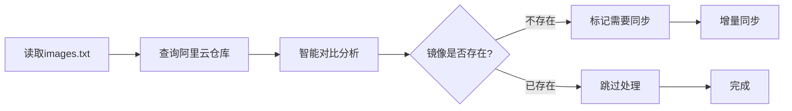

# Docker Images Pusher

[](https://github.com/gqy20/docker_image_pusher/stargazers)
[](https://github.com/gqy20/docker_image_pusher/network)
[](https://github.com/gqy20/docker_image_pusher/blob/main/LICENSE)

> 使用 GitHub Action 将国外的 Docker 镜像转存到阿里云私有仓库，供国内服务器使用，免费易用

**原作作者：[技术爬爬虾](https://github.com/tech-shrimp/me)** | Fork 自原作并进行优化改进

## ✨ 特性

- 🚀 **多仓库支持** - 支持 DockerHub、gcr.io、k8s.io、ghcr.io 等任意仓库
- 📦 **大镜像支持** - 支持最大 40GB 的大型镜像
- ⚡ **高速传输** - 使用阿里云官方线路，速度快
- 🏗️ **多架构支持** - 支持 AMD64、ARM64 等多种架构
- 🔄 **自动化同步** - 支持定时自动同步更新
- 📝 **智能重名处理** - 自动处理镜像重名情况
- 🎯 **零成本使用** - 完全免费，无需服务器
- 🌐 **Web管理界面** - 提供直观的Web界面进行镜像管理和状态监控
- 🎛️ **可视化操作** - 通过浏览器轻松触发工作流、查看镜像状态
- 📊 **实时监控** - 实时显示同步进度和执行状态

## 📺 视频教程

[B站视频教程](https://www.bilibili.com/video/BV1Zn4y19743/)

## 🌐 Web管理界面

项目现在提供了直观的Web管理界面，让您能够通过浏览器轻松管理Docker镜像同步：

### 🔗 访问地址
- **GitHub Pages**: `https://[你的用户名].github.io/docker_image_pusher/`
- *注：部署后需要等待几分钟才能访问*

### ✨ Web界面功能

- 🎛️ **可视化镜像管理** - 通过表单输入镜像列表，支持格式验证
- 🚀 **一键同步** - 点击按钮触发GitHub Actions工作流
- 📊 **实时状态监控** - 实时显示同步进度和执行状态
- 📜 **历史记录** - 查看所有同步任务的历史记录和详细信息
- ⚙️ **设置管理** - 配置GitHub认证信息和刷新间隔
- 🔍 **镜像验证** - 验证镜像格式并显示警告信息
- 📱 **响应式设计** - 完美适配桌面和移动设备

### 🛠️ 使用步骤

1. **访问Web界面** - 打开GitHub Pages链接
2. **配置认证** - 点击设置按钮，输入GitHub仓库所有者和Personal Access Token
3. **测试连接** - 验证GitHub API连接是否正常
4. **输入镜像** - 在文本框中输入要同步的镜像列表（每行一个）
5. **选择选项** - 可选择强制更新或仅检测模式
6. **开始同步** - 点击"开始同步"按钮触发工作流
7. **监控进度** - 实时查看同步状态和执行结果

### 🔑 GitHub Token配置

1. 访问 [GitHub Token设置](https://github.com/settings/tokens/new)
2. 创建新的Personal Access Token，需要以下权限：
   - `repo` - 访问仓库
   - `workflow` - 触发工作流
3. 复制生成的Token（仅显示一次）
4. 在Web界面设置中填入Token

### 📋 支持的镜像格式

```bash
# 基本格式
nginx
nginx:1.21-alpine

# 指定架构
nginx --platform=linux/arm64

# 不同仓库
k8s.gcr.io/kube-state-metrics/kube-state-metrics:v1.9.0
ghcr.io/actions/runner:latest

# 批量格式
nginx:latest
redis:7.0
ubuntu:22.04
--platform=linux/arm64 node:18
```

## 📖 目录

- [Web管理界面](#-web管理界面)
- [快速开始](#-快速开始)
- [详细配置](#-详细配置)
- [使用说明](#-使用说明)
- [高级功能](#-高级功能)
- [常见问题](#-常见问题)
- [贡献指南](#-贡献指南)

## 🚀 快速开始

### 1. 配置阿里云并获取凭证

登录 [阿里云容器镜像服务](https://cr.console.aliyun.com/)，启用个人实例并创建命名空间。

**获取以下凭证信息：**
- 仓库地址：`ALIYUN_REGISTRY`
- 命名空间：`ALIYUN_NAME_SPACE`
- 用户名：`ALIYUN_REGISTRY_USER`
- 密码：`ALIYUN_REGISTRY_PASSWORD`

### 2. Fork 项目并配置密钥

1. Fork 本项目到你的 GitHub 账户
2. 进入项目的 Settings → Secrets and variables → Actions
3. 添加 Repository secrets：

| 变量名 | 对应信息 |
|--------|----------|
| `ALIYUN_REGISTRY` | 阿里云仓库地址 |
| `ALIYUN_NAME_SPACE` | 阿里云命名空间 |
| `ALIYUN_REGISTRY_USER` | 阿里云用户名 |
| `ALIYUN_REGISTRY_PASSWORD` | 阿里云密码 |

### 3. 添加镜像

编辑 `images.txt` 文件，每行一个镜像：

```bash
# 基本格式
nginx
nginx:1.21-alpine
# 指定架构
nginx --platform=linux/arm64
# 不同仓库
k8s.gcr.io/kube-state-metrics/kube-state-metrics:v1.9.0
ghcr.io/actions/runner:latest
```

### 4. 启动同步

提交 `images.txt` 文件，GitHub Action 将自动开始智能同步。

## 📝 使用说明

### images.txt 文件格式

```bash
# 注释行以 # 开头
nginx                                    # 默认使用 latest 标签
nginx:1.21-alpine                        # 指定标签
nginx --platform=linux/arm64             # 指定架构
k8s.gcr.io/kube-state-metrics/kube-state-metrics:v2.0.0  # k8s 镜像
ghcr.io/actions/runner:latest             # GitHub Container Registry
```

### 拉取镜像

同步完成后，在国内服务器上拉取镜像：

```bash
docker pull registry.cn-hangzhou.aliyuncs.com/你的命名空间/镜像名:标签
```

示例：
```bash
docker pull registry.cn-hangzhou.aliyuncs.com/my-namespace/nginx:latest
```

### 多架构支持

在 `images.txt` 中使用 `--platform` 参数指定镜像架构：

```bash
# 单架构示例
--platform=linux/arm64 nginx

# 多架构示例（同一镜像的不同架构）
--platform=linux/amd64 ubuntu
--platform=linux/arm64 ubuntu

# 其他常用架构
--platform=linux/arm64/v8 node
--platform=linux/386 alpine
```

**命名规则：** 指定架构后，架构名称会以前缀形式添加到镜像名前面，如：
```
registry.cn-hangzhou.aliyuncs.com/namespace/linux_arm64_nginx:latest
```

### 镜像重名处理

程序会自动检测重名镜像并智能处理：

```bash
# 如果有重名镜像，会自动添加命名空间前缀
xhofe/alist           # 同步为 xhofe_alist
xiaoyaliu/alist       # 同步为 xiaoyaliu_alist
```


### 智能同步机制

系统采用**智能仓库对比**策略，只同步缺失的镜像，避免重复传输：

**🔄 触发方式：**
- **手动触发**: GitHub Actions页面可手动执行
- **配置变更**: 修改`images.txt`时自动触发
- **定时检查**: 每天北京时间上午8点自动检查
- **强制同步**: 支持强制同步所有镜像选项

**⚡ 同步逻辑：**


**🎯 核心特性：**
- 只同步缺失的镜像，已存在镜像自动跳过
- 支持多架构、重名镜像的智能处理
- 自动生成同步统计报告

### 定时更新说明

**⏰ 自动更新时间：** 每周一北京时间上午6点

**📋 更新规则：**
- ✅ **无版本标签镜像**（如 `nginx`）→ 自动更新到最新版本
- ✅ **:latest 镜像** → 覆盖更新到最新版本
- ❌ **指定版本镜像**（如 `postgres:15-alpine`）→ 保持不变

**📍 更新机制：**
- 采用**覆盖更新**模式，不创建新的版本标签
- 只更新现有标签的内容，如 `nginx:latest` 从1.20更新到1.21
- 多架构镜像同样支持自动更新

### 自定义定时同步

如需修改定时同步时间，编辑 `.github/workflows/docker.yaml` 文件中的 `schedule` 配置：

```yaml
schedule:
  # 每天 UTC 时间 01:00 执行（北京时间上午9点）
  - cron: '0 1 * * *'
```

**常用 cron 表达式：**
- `0 2 * * *` - 每天北京时间上午10点
- `0 2 * * 1` - 每周一北京时间上午10点
- `*/30 * * * *` - 每30分钟


### 镜像状态查看

回到阿里云镜像仓库，可以查看镜像同步状态。可以将镜像设为公开，实现免登录拉取。


## 🌍 多云支持

### 国内云服务商对比

目前支持以下国内云服务商的容器镜像服务：

| 云服务商 | 个人版命名空间数 | 个人版仓库数 | 免费存储 | 访问速度 | 特色说明 |
|----------|------------------|--------------|----------|----------|----------|
| [阿里云ACR](https://help.aliyun.com/zh/acr/) | 3个 | 300个 | 5GB | ⭐⭐⭐⭐⭐ | 国内访问最快，支持安全扫描 |
| [腾讯云TCR](https://cloud.tencent.com/document/product/1141) | 10个 | 100个<br>*广州500* | 10GB | ⭐⭐⭐⭐<br>*广州可达⭐⭐⭐⭐⭐* | API丰富度最高，企业级功能完善 |
| [华为云SWR](https://support.huaweicloud.com/productdesc-swr/swr_03_0001.html) | 5个 | **无限制**<br>*已工单确认* | 10GB | ⭐⭐⭐⭐ | 安全性强，适合企业级应用 |
| [UCloud UHub](https://docs.ucloud.cn/uhub/README) | 每项目1个 | 无限制 | 免费 | ⭐⭐⭐<br>*外网限速1MB/s* | 提供师生优惠政策，适合学术研究 |

### 服务状态说明

**🟢 推荐使用（支持个人版）：**
- **阿里云ACR** - 个人版免费额度最优，国内访问速度最快
- **腾讯云TCR** - API功能最丰富，企业级功能完善
- **华为云SWR** - 安全性强，仓库数量无限制
- **UCloud UHub** - 提供师生学术优惠，适合高校用户

**🔴 企业版-only（无个人版）：**
- **百度智能云CCR** - 个人版已关闭新建入口
- **金山云KCR** - 纯付费服务，无免费版本

### 重要限制说明

**UCloud UHub使用限制：**
- 外网拉取速度限制1MB/s
- 单层镜像>5GB可能推送失败
- 每个项目仅支持创建一个镜像仓库

**师生认证优惠：**
- UCloud提供教职人员和在校学生学术优惠（¥499）
- 需提供校园网站信息页截图或教师资格证进行认证


## ❓ 常见问题

### 🔧 配置与故障排查

**Q: 同步失败了怎么办？**
A: 检查以下几点：
1. 确认阿里云配置正确（`ALIYUN_NAME_SPACE` 不能为空）
2. 检查源镜像是否存在
3. 确认镜像大小不超过40GB限制
4. 查看 GitHub Action 日志获取详细错误信息

**常见错误：**
- `invalid reference format`: `ALIYUN_NAME_SPACE` 配置为空
- `denied: requested access to the resource is denied`: 用户名或密码错误
- `Error processing tar file`: 镜像损坏或网络问题

**Q: 同步速度很慢怎么办？**
A: 同步速度受源镜像位置、镜像大小、网络状况影响，建议在网络较好的时间段同步。

### 📦 镜像管理

**Q: 可以同时同步多个镜像吗？**
A: 可以，在 `images.txt` 中每行一个镜像即可，系统会并行处理。

**Q: 如何删除已同步的镜像？**
A: 登录阿里云容器镜像服务，手动删除不需要的镜像。

**Q: 支持私有镜像同步吗？**
A: 目前不支持私有镜像，仅支持公共镜像仓库。

### 🔄 智能同步机制

**Q: 每次修改images.txt都会同步所有镜像吗？**
A: 不会！系统采用**智能增量同步**：
- 只有 `images.txt` 变化时才触发同步
- 只处理新增或修改的镜像
- 已存在的镜像不会重复拉取，节省时间和带宽

**Q: 智能同步会更新已存在的镜像吗？**
A: 当前版本主要处理：
- ✅ **缺失镜像**: 自动检测并同步
- ✅ **新增配置**: 发现新配置后立即同步
- ⏳ **版本更新**: 未来版本将支持版本检测

**Q: 如何强制同步所有镜像？**
A: 在 GitHub Actions 页面手动触发，选择 "Force sync: true" 选项

### ⏰ 定时更新

**Q: 定时更新会影响我指定的版本吗？**
A: 不会。只处理无版本标签（如 `nginx`）和 `:latest` 的镜像。具体版本（如 `postgres:15-alpine`）保持不变。

**Q: 定时更新后会有多个镜像版本吗？**
A: 不会。采用**覆盖更新**模式，只更新现有标签内容。如需保留特定版本，请手动指定版本号。

**Q: 更新后正在使用的服务会受影响吗？**
A: 使用 `:latest` 标签的服务在重新拉取时会获取新版本。生产环境建议指定具体版本号。

### 🛠️ 系统功能

**Q: 如何手动触发镜像更新？**
A: 在 GitHub Actions 页面手动触发工作流，或编辑 `images.txt` 文件触发更新。

## 🤝 贡献指南

欢迎提交 Issue 和 Pull Request！

### 提交 Issue
- 使用清晰描述标题
- 提供详细的错误信息和复现步骤
- 附上相关日志信息

### 提交 Pull Request
- Fork 本项目
- 创建特性分支 (`git checkout -b feature/AmazingFeature`)
- 提交更改 (`git commit -m 'Add some AmazingFeature'`)
- 推送到分支 (`git push origin feature/AmazingFeature`)
- 创建 Pull Request

## 📄 许可证

本项目采用 MIT 许可证 - 查看 [LICENSE](LICENSE) 文件了解详情。

## 🙏 致谢

**原作作者：[技术爬爬虾](https://github.com/tech-shrimp/me)**

B站、抖音、YouTube 全网同名，转载请注明原作者

- 📺 [B站视频教程](https://www.bilibili.com/video/BV1Zn4y19743/)
- 🐛 [原作者 GitHub](https://github.com/tech-shrimp/me)
- 🌟 [给原作者项目点 Star](https://github.com/tech-shrimp/docker-image-pusher)

### 支持作者

如果这个项目对你有帮助，请给个 ⭐ Star 支持一下！

## 📞 联系方式

- GitHub Issues: [提交问题](https://github.com/gqy20/docker_image_pusher/issues)
- 原作者 B站: [@技术爬爬虾](https://www.bilibili.com/video/BV1Zn4y19743/)

---

**⚠️ 重要声明**：本项目基于 [技术爬爬虾](https://github.com/tech-shrimp/me) 的原作进行 Fork 和优化，版权归原作者所有。
