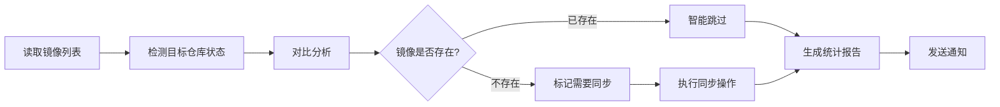

# Docker Images Pusher

[](https://github.com/gqy20/docker_image_pusher/stargazers)
[](https://github.com/gqy20/docker_image_pusher/network)
[](https://github.com/gqy20/docker_image_pusher/blob/main/LICENSE)
[](https://github.com/gqy20/docker_image_pusher/actions)

> 🚀 **企业级Docker镜像同步工具** - 使用 GitHub Actions 将国外Docker镜像智能转存到阿里云私有仓库，支持多种触发方式、智能重名处理、多架构同步，免费易用

**原作作者：[技术爬爬虾](https://github.com/tech-shrimp/me)** | Fork 自原作并进行企业级优化改进

## ✨ 核心特性

### 🔄 **多样化触发方式**
- **📝 Issue触发** - 通过GitHub Issue快速提交同步请求
- **🤖 自动同步** - 每日定时智能检查和同步
- **⚡ 手动触发** - GitHub Actions页面一键执行
- **📂 文件变更** - 修改images.txt自动触发同步

### 🧠 **智能同步机制**
- **🎯 增量同步** - 只同步缺失镜像，避免重复传输
- **🔍 存在性检测** - 自动检测目标仓库镜像状态
- **🏷️ 重名处理** - 智能处理同名镜像，添加命名空间前缀
- **📊 详细报告** - 实时显示同步进度和结果统计

### 🏗️ **企业级功能**
- **📦 多仓库支持** - DockerHub、gcr.io、k8s.io、ghcr.io等任意仓库
- **💾 大镜像支持** - 支持最大40GB的大型镜像
- **🌐 多架构支持** - AMD64、ARM64等多种架构同步
- **⚙️ 高级配置** - 强制同步、干运行、批量处理

### 🎛️ **Web管理界面**
- **🖥️ 可视化操作** - 直观的Web界面管理镜像同步
- **📱 响应式设计** - 完美适配桌面和移动设备
- **🔄 实时监控** - 实时显示同步状态和进度
- **📜 历史记录** - 查看所有同步任务的详细记录

## 📺 视频教程

[](https://www.bilibili.com/video/BV1Zn4y19743/)

## 🌐 Web管理界面

项目提供了直观的Web管理界面，让您能够通过浏览器轻松管理Docker镜像同步：

### 🔗 访问地址
- **GitHub Pages**: `https://[你的用户名].github.io/docker_image_pusher/`
- *注：部署后需要等待几分钟才能访问*

### ✨ Web界面功能

- 🎛️ **可视化镜像管理** - 通过表单输入镜像列表，支持格式验证
- 🚀 **一键同步** - 点击按钮触发GitHub Actions工作流
- 📊 **实时状态监控** - 实时显示同步进度和执行状态
- 📜 **历史记录** - 查看所有同步任务的历史记录和详细信息
- ⚙️ **设置管理** - 配置GitHub认证信息和刷新间隔
- 🔍 **镜像验证** - 验证镜像格式并显示警告信息
- 📱 **响应式设计** - 完美适配桌面和移动设备

### 🛠️ 使用步骤

1. **访问Web界面** - 打开GitHub Pages链接
2. **配置认证** - 点击设置按钮，输入GitHub仓库所有者和Personal Access Token
3. **测试连接** - 验证GitHub API连接是否正常
4. **输入镜像** - 在文本框中输入要同步的镜像列表（每行一个）
5. **选择选项** - 可选择强制更新或仅检测模式
6. **开始同步** - 点击"开始同步"按钮触发工作流
7. **监控进度** - 实时查看同步状态和执行结果

## 🚀 快速开始

### 1. 配置阿里云并获取凭证

登录 [阿里云容器镜像服务](https://cr.console.aliyun.com/)，启用个人实例并创建命名空间。

**获取以下凭证信息：**
- 仓库地址：`ALIYUN_REGISTRY`
- 命名空间：`ALIYUN_NAME_SPACE`
- 用户名：`ALIYUN_REGISTRY_USER`
- 密码：`ALIYUN_REGISTRY_PASSWORD`

### 2. Fork 项目并配置密钥

1. Fork 本项目到你的 GitHub 账户
2. 进入项目的 Settings → Secrets and variables → Actions
3. 添加 Repository secrets：

| 变量名 | 对应信息 |
|--------|----------|
| `ALIYUN_REGISTRY` | 阿里云仓库地址 |
| `ALIYUN_NAME_SPACE` | 阿里云命名空间 |
| `ALIYUN_REGISTRY_USER` | 阿里云用户名 |
| `ALIYUN_REGISTRY_PASSWORD` | 阿里云密码 |

### 3. 多种同步方式选择

#### 🎯 方式一：Issue触发同步（推荐）

1. 在仓库中创建新Issue
2. 使用 "Docker镜像同步" 模板
3. 填写镜像列表，支持格式：
   ```bash
   nginx:latest
   redis:7.0
   ubuntu:22.04
   --platform=linux/arm64 node:18
   k8s.gcr.io/pause:3.9
   ```
4. 添加 `sync` 标签
5. 自动触发智能同步，结果会显示在Issue中

#### 📂 方式二：配置文件同步

1. 创建 `images.txt` 文件
2. 每行一个镜像：
   ```bash
   # 基本格式
   nginx
   nginx:1.21-alpine
   # 指定架构
   nginx --platform=linux/arm64
   # 不同仓库
   k8s.gcr.io/kube-state-metrics/kube-state-metrics:v1.9.0
   ghcr.io/actions/runner:latest
   ```
3. 提交文件，自动触发智能同步

#### ⚡ 方式三：手动触发

1. 进入 GitHub Actions 页面
2. 选择 "Manual Docker Image Sync" 工作流
3. 点击 "Run workflow"
4. 输入镜像列表（逗号分隔）
5. 选择是否强制更新和干运行模式

## 📋 同步方式对比

| 方式 | 触发条件 | 适用场景 | 优势 | 特点 |
|------|----------|----------|------|------|
| 🎯 Issue触发 | 创建带sync标签的Issue | 临时、少量镜像 | 界面友好，自动反馈 | 自动关闭Issue |
| 📂 配置文件 | 修改images.txt | 批量、固定镜像 | 版本控制，批量处理 | 智能检测变化 |
| ⚡ 手动触发 | GitHub Actions页面 | 临时、多样化需求 | 灵活配置，多种选项 | 支持干运行 |
| 🤖 定时同步 | 每日自动执行 | :latest镜像更新 | 自动维护最新版本 | 仅更新latest标签 |

## 🔧 高级功能

### 🎯 Issue触发同步详解

Issue触发是最便捷的同步方式，具有以下特点：

- **📝 标准化模板** - 使用预定义Issue模板，格式规范
- **🏷️ 智能识别** - 自动识别带有 `sync` 标签的Issue
- **🔍 格式验证** - 自动验证镜像格式，支持多种仓库
- **📊 实时反馈** - 同步进度和结果实时显示在Issue中
- **✅ 自动关闭** - 全部成功后自动关闭Issue
- **🚀 智能跳过** - 自动检测已存在镜像，避免重复同步

**Issue格式示例：**
```markdown
### 📦 镜像列表

```
nginx:latest
redis:7.0
ubuntu:22.04
--platform=linux/arm64 node:18
k8s.gcr.io/coredns/coredns:v1.10.1
ghcr.io/actions/runner:latest
```

### 🏷️ 智能重名处理

系统自动检测并智能处理重名镜像：

```bash
# 重名镜像示例
xhofe/alist           # 同步为 xhofe_alist
xiaoyaliu/alist       # 同步为 xiaoyaliu_alist
nginx/nginx            # 同步为 nginx_nginx
```

**重名检测逻辑：**
- 自动提取镜像基本名称（去除仓库前缀和标签）
- 检测是否存在重名情况
- 为重名镜像添加原始命名空间前缀
- 确保目标仓库中的镜像名称唯一性

### 🏗️ 多架构支持

支持多种CPU架构的镜像同步：

```bash
# 单架构同步
--platform=linux/amd64 ubuntu:22.04
--platform=linux/arm64 ubuntu:22.04

# 多架构同步（同一镜像不同架构）
--platform=linux/amd64 node:18
--platform=linux/arm64 node:18
--platform=linux/arm64/v8 node:18

# 常用架构类型
linux/amd64     # x86_64架构
linux/arm64     # ARM64架构
linux/arm64/v8  # ARM64 v8架构
linux/386       # x86 32位架构
```

**多架构命名规则：**
```
registry.cn-hangzhou.aliyuncs.com/namespace/linux_amd64_nginx:latest
registry.cn-hangzhou.aliyuncs.com/namespace/linux_arm64_nginx:latest
```

### 🧠 智能同步机制

采用**增量同步**策略，只同步缺失的镜像：



**核心特性：**
- ✅ **智能跳过** - 已存在镜像自动跳过，节省时间和带宽
- ✅ **增量同步** - 只处理新增或变更的镜像
- ✅ **详细统计** - 提供总数、成功、跳过、失败的详细统计
- ✅ **错误处理** - 完善的错误处理和重试机制

### ⚙️ 手动触发高级选项

手动触发模式提供丰富的配置选项：

- **镜像列表** - 支持逗号分隔的批量输入
- **强制更新** - 强制覆盖已存在的镜像
- **干运行模式** - 仅检测镜像状态，不实际同步
- **批量处理** - 一次性处理多个镜像

**使用场景：**
- 🆕 **新增镜像** - 批量添加新的镜像到仓库
- 🔄 **强制更新** - 忽略缓存，强制重新同步
- 🔍 **状态检查** - 干运行模式检查镜像状态
- 🚨 **故障恢复** - 重新同步失败的镜像

## 🤖 GitHub Actions 工作流

项目包含多个专业化的工作流：

### 1. docker.yaml - 主同步工作流
- **触发方式**：推送、定时、手动
- **智能同步**：只同步缺失镜像
- **定时检查**：每日北京时间上午8点
- **强制选项**：支持强制同步所有镜像

### 2. issue-sync.yml - Issue触发工作流
- **触发方式**：创建带sync标签的Issue
- **格式支持**：代码块和模板格式
- **智能提取**：自动提取Issue中的镜像列表
- **自动回复**：同步结果自动回复到Issue

### 3. manual-sync.yml - 手动同步工作流
- **触发方式**：GitHub Actions手动触发
- **批量输入**：支持逗号分隔的镜像列表
- **高级选项**：强制更新、干运行模式
- **实时反馈**：详细的执行日志和统计

### 4. update-latest.yml - Latest更新工作流
- **触发方式**：定时（每周一）+ 手动
- **更新范围**：仅更新latest标签镜像
- **安全策略**：保持指定版本镜像不变
- **自动化**：自动维护最新版本

### 5. deploy-pages.yml - Web界面部署
- **触发方式**：推送web目录时
- **自动部署**：GitHub Pages自动部署
- **实时更新**：界面功能实时同步

## 📖 使用指南

### 📦 支持的镜像格式

```bash
# 基本格式
nginx                    # 默认latest标签
nginx:1.21-alpine        # 指定标签

# 架构指定
nginx --platform=linux/arm64              # 单架构
node:18 --platform=linux/amd64            # AMD64架构
ubuntu --platform=linux/arm64/v8          # ARM64 v8架构

# 不同仓库
docker.io/library/nginx:latest             # Docker Hub
k8s.gcr.io/pause:3.9                      # Kubernetes镜像
ghcr.io/actions/runner:latest              # GitHub Container Registry
quay.io/prometheus/prometheus:latest       # Quay.io镜像

# 复杂格式示例
gcr.io/kaniko-project/executor:latest      # Google Container Registry
mcr.microsoft.com/dotnet/sdk:6.0           # Microsoft Container Registry
```

### 🔄 镜像拉取示例

同步完成后，在国内服务器拉取镜像：

```bash
# 基本拉取
docker pull registry.cn-hangzhou.aliyuncs.com/你的命名空间/nginx:latest

# 多架构镜像拉取
docker pull registry.cn-hangzhou.aliyuncs.com/你的命名空间/linux_arm64_nginx:latest

# 重名镜像拉取
docker pull registry.cn-hangzhou.aliyuncs.com/你的命名空间/xhofe_alist:latest
```

### 📊 同步状态监控

同步完成后，可通过以下方式查看状态：

1. **GitHub Actions日志** - 详细的执行日志和错误信息
2. **Issue回复** - Issue触发模式的详细报告
3. **阿里云控制台** - 目标仓库的镜像列表
4. **Web界面** - 实时状态和历史记录

### 🔧 故障排查

**常见问题及解决方案：**

```bash
# 1. 配置错误
invalid reference format           # 检查ALIYUN_NAME_SPACE是否为空
denied: requested access          # 检查阿里云用户名密码是否正确

# 2. 镜像问题
Error processing tar file          # 镜像损坏或网络问题
manifest unknown                  # 镜像不存在或标签错误

# 3. 权限问题
permission denied while trying to connect # Docker权限问题
no space left on device           # 磁盘空间不足
```

## 🌍 多云支持

### 国内云服务商对比

目前支持以下国内云服务商的容器镜像服务：

| 云服务商 | 个人版命名空间数 | 个人版仓库数 | 免费存储 | 访问速度 | 特色说明 |
|----------|------------------|--------------|----------|----------|----------|
| [阿里云ACR](https://help.aliyun.com/zh/acr/) | 3个 | 300个 | 5GB | ⭐⭐⭐⭐⭐ | 国内访问最快，支持安全扫描 |
| [腾讯云TCR](https://cloud.tencent.com/document/product/1141) | 10个 | 100个<br>*广州500* | 10GB | ⭐⭐⭐⭐<br>*广州可达⭐⭐⭐⭐⭐* | API丰富度最高，企业级功能完善 |
| [华为云SWR](https://support.huaweicloud.com/productdesc-swr/swr_03_0001.html) | 5个 | **无限制**<br>*已工单确认* | 10GB | ⭐⭐⭐⭐ | 安全性强，适合企业级应用 |
| [UCloud UHub](https://docs.ucloud.cn/uhub/README) | 每项目1个 | 无限制 | 免费 | ⭐⭐⭐<br>*外网限速1MB/s* | 提供师生优惠政策，适合学术研究 |

### 服务状态说明

**🟢 推荐使用（支持个人版）：**
- **阿里云ACR** - 个人版免费额度最优，国内访问速度最快
- **腾讯云TCR** - API功能最丰富，企业级功能完善
- **华为云SWR** - 安全性强，仓库数量无限制
- **UCloud UHub** - 提供师生学术优惠，适合高校用户

**🔴 企业版-only（无个人版）：**
- **百度智能云CCR** - 个人版已关闭新建入口
- **金山云KCR** - 纯付费服务，无免费版本

### 重要限制说明

**UCloud UHub使用限制：**
- 外网拉取速度限制1MB/s
- 单层镜像>5GB可能推送失败
- 每个项目仅支持创建一个镜像仓库

**师生认证优惠：**
- UCloud提供教职人员和在校学生学术优惠（¥499）
- 需提供校园网站信息页截图或教师资格证进行认证

### 推荐配置

**🎯 个人用户推荐：**
- **阿里云ACR** - 速度最快，个人版免费额度优厚
- **腾讯云TCR** - 功能丰富，API接口完善

**🏢 企业用户推荐：**
- **华为云SWR** - 安全性最强，仓库数量无限制
- **阿里云ACR企业版** - 企业级功能完善

## ❓ 常见问题

### 🔧 配置相关问题

**Q: 如何配置多个命名空间？**
A: 目前不支持，但可以Fork多个项目分别配置不同命名空间。

**Q: 支持私有镜像同步吗？**
A: 目前仅支持公共镜像仓库，私有镜像需要额外认证。

**Q: 同步速度慢怎么办？**
A: 可尝试在网络较好时段同步，或检查源镜像的CDN节点。

### 🚀 功能相关问题

**Q: Issue触发和文件触发的区别？**
A: Issue触发适合临时少量同步，文件触发适合批量固定镜像管理。

**Q: 如何强制同步所有镜像？**
A: 手动触发时选择"force_sync: true"选项。

**Q: 智能同步会更新已存在镜像吗？**
A: 默认跳过已存在镜像，如需更新请使用强制同步。

**Q: 支持哪些Docker镜像仓库？**
A: 支持所有公共镜像仓库：Docker Hub、GCR、GHCR、Quay等。

### 📊 监控和报告

**Q: 如何查看同步历史？**
A: 通过Web界面的历史记录或GitHub Actions日志。

**Q: 同步失败如何重试？**
A: 失败的镜像可在下次同步时自动重试，或手动强制同步。

**Q: 如何获取同步统计？**
A: 同步完成后会生成详细统计报告，包含成功/失败/跳过数量。

## 🤝 贡献指南

我们欢迎社区贡献！请遵循以下指南：

### 🐛 提交问题
- 使用清晰的标题描述问题
- 提供详细的复现步骤和环境信息
- 附上相关的日志和截图
- 检查是否为重复问题

### 💡 功能建议
- 描述新功能的用途和场景
- 说明实现思路和预期效果
- 考虑向后兼容性

### 🔧 代码贡献
1. Fork 项目到你的账户
2. 创建功能分支：`git checkout -b feature/amazing-feature`
3. 提交更改：`git commit -m 'Add amazing feature'`
4. 推送分支：`git push origin feature/amazing-feature`
5. 创建 Pull Request

### 📝 代码规范
- 遵循现有代码风格
- 添加必要的注释和文档
- 确保所有测试通过
- 更新相关文档

## 📄 许可证

本项目采用 [MIT 许可证](LICENSE) - 允许自由使用、修改和分发。

## 🙏 致谢

**原作作者：[技术爬爬虾](https://github.com/tech-shrimp/me)**

感谢原作者提供的基础项目，我们在其基础上进行了大量优化和功能增强：

### 🚀 主要改进
- **智能同步机制** - 增量同步，避免重复传输
- **Issue触发模式** - 更便捷的同步方式
- **多架构支持** - 完善的多平台架构同步
- **Web管理界面** - 可视化操作界面
- **高级工作流** - 多样化的触发和配置选项
- **重名处理** - 智能处理同名镜像冲突
- **详细统计** - 完善的同步报告和监控

### 📺 原作者信息
- 📺 [B站视频教程](https://www.bilibili.com/video/BV1Zn4y19743/)
- 🐛 [原作者 GitHub](https://github.com/tech-shrimp/me)
- 🌟 [原作项目](https://github.com/tech-shrimp/docker-image-pusher)

### 🌟 支持我们

如果这个项目对你有帮助，请：
- 给个 ⭐ Star 支持一下
- 分享给有需要的朋友
- 提交 Issue 和 PR 参与改进

## 📞 联系方式

- **GitHub Issues**: [提交问题](https://github.com/gqy20/docker_image_pusher/issues)
- **原作B站**: [@技术爬爬虾](https://www.bilibili.com/video/BV1Zn4y19743/)

---

**⚠️ 重要声明**：本项目基于 [技术爬爬虾](https://github.com/tech-shrimp/me) 的原作进行 Fork 和优化改进，版权归原作者所有。本项目遵循 MIT 许可证开源，供学习和商业使用。